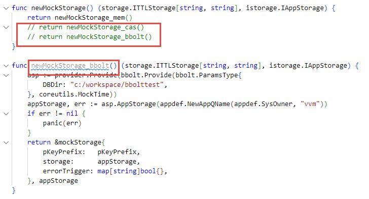
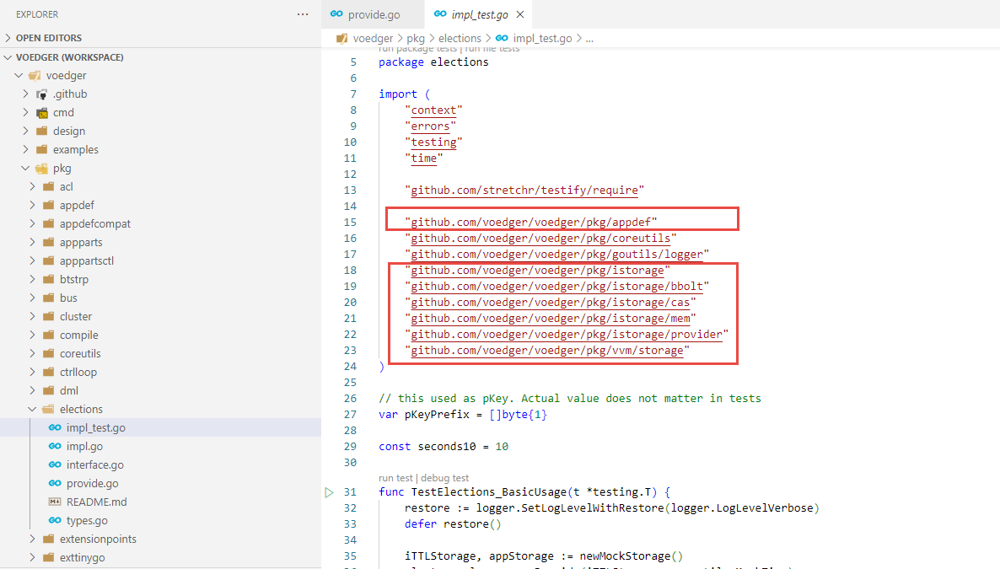

# Go-based development guidelines

This document provides guidelines for Go-based development at Voedger project.

## Foundations and Key References

- [Effective Go](https://go.dev/doc/effective_go)
- [Go Proverbs](https://go-proverbs.github.io/)
  - Rob Pike’s Go Proverbs
    - [Part One](https://golangprojectstructure.com/rob-pike-go-proverbs/)
    - [Part Two](https://golangprojectstructure.com/rob-pike-go-proverbs-2/)
    - [Part Three)](https://golangprojectstructure.com/rob-pike-go-proverbs-3/)
- [10 things you (probably) don't know about Go](https://go.dev/talks/2012/10things.slide)
- https://go.dev/blog/subtests
- https://go101.org/article/type-system-overview.html

## Go package structure

- [guide: go package structure](https://github.com/voedger/kb/issues/45)

## Concurrency and review

If a developer implements something related to concurrency (e.g., using goroutines or the sync package), a code review must be conducted by AI, too (e.g., ChatGPT). An [example](https://github.com/voedger/kb/issues/57).

## testdata folder

`testdata` folder: name is special for the Go toolchain, which will ignore files in it (so you can place files named *.go there, for example, and they won't be built or analyzed)

## Avoid using .cmd files

Do not use `.cmd` files, use `.sh` or `.bash`.

## Black-box testing

Test files shall be in the `<testing-package>_test` package, whenever posisble (black-box testing).

## Avoid anti-patterns

[Dynamic anti-patterns](se.md#dynamic-anti-patterns):

- Busy Waiting (Spin Waiting)
- Goroutine/Task/Thread Leak
- Heap Escape Without Reuse (especially in hot paths)

## Testable Examples in Go

If possible create testable examples for your code. They are a great way to document your code and provide examples of how to use it.

- [Testable Examples in Go](https://go.dev/blog/examples)
- [https://cs.opensource.google/go/src/encoding/binary/example_test.go](https://cs.opensource.google/go/go/+/refs/tags/go1.20.5:src/encoding/binary/example_test.go;l=14;drc=2580d0e08d5e9f979b943758d3c49877fb2324cb)
- https://pkg.go.dev/encoding/binary#example-Write
- [voedger/pkg/in10nmem/example_test.go](https://github.com/voedger/voedger/blob/15ef848eecdc1950a6eba71732991012d509be18/pkg/in10nmem/example_test.go#L21)

## Avoid commented-out and dead code

## Avoid tightly coupling between packages

Even in tests:

If it is necessary to integrally test the package with injected dependencies:

- Create a test suite that tests the interface (IElections, in this case)
- Use this test suite in the package (elections, in this case)
- Use this test suite in the packages where injections are provided
